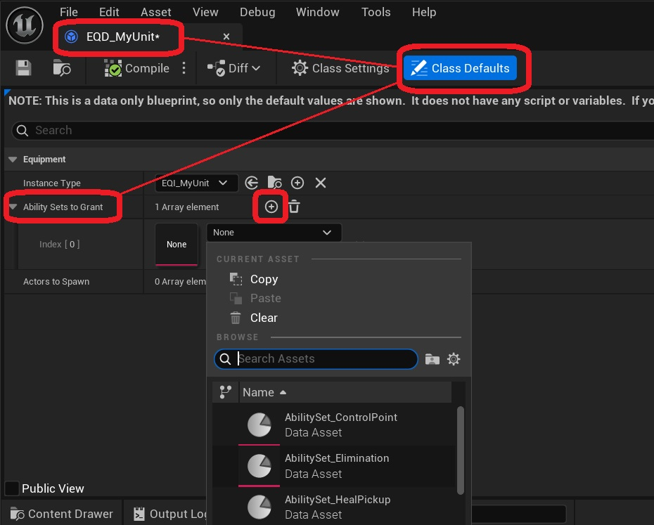

Units can have their own unique ability sets.

To add abilities, gameplay effects or attributes to a unit, open the Equipment Definition for your unit *(EQD_MyUnit)*, and modify the Ability Sets To Grant variable.  

This functionality is not unique to the plugin, but part of the equipment system in Lyra. For more information on ability sets, please consult the <a href="https://dev.epicgames.com/documentation/en-us/unreal-engine/abilities-in-lyra-in-unreal-engine">documentation on gameplay abilities in Lyra</a>.
 

