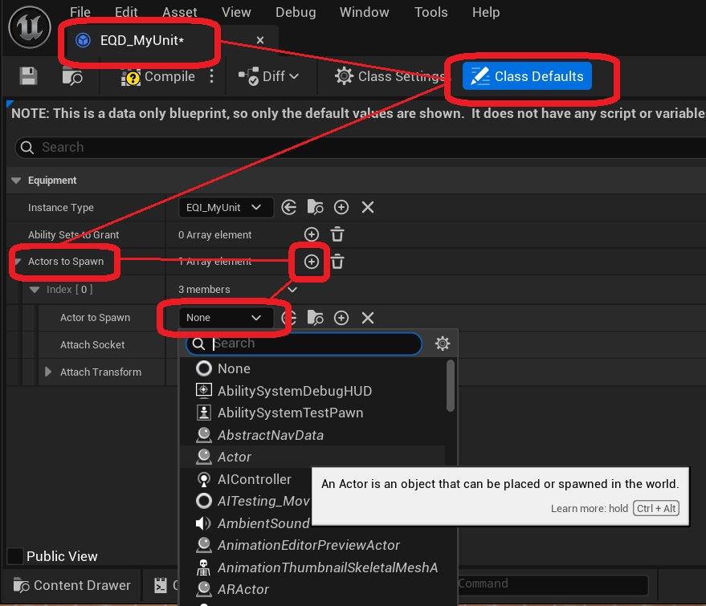

Units can spawn actors while they are selected. To do so, open the Equipment Definition for your unit *(EQD_MyUnit)*, and modify the Animation Layers variable.

This functionality is not unique to the plugin, but part of the equipment system in Lyra. It is designed mostly for weapons that are equipped and need to spawn replicated actors. When using the Lyra Unit Selection plugin as a character selection system, it is suggested to use the <a href="/lyra-unit-selection/002-customization/070-skeletal-mesh-character-parts">settings related to skeletal meshes and character parts</a> instead.
 

