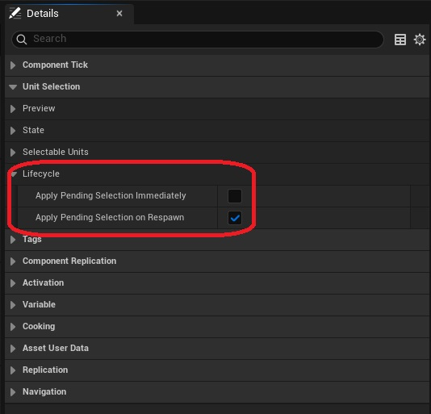
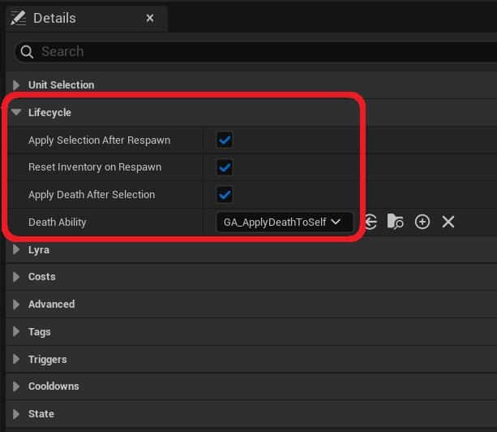

It is possible that selecting a unit affects the lifecycle of the character. 

* In most projects, we want to wait until the player respawns before applying their selection, rather than applying it instantly. This behaviour can de adjusted in the Unit Selection Component class used in your project (e.g. B_UnitSelectionComponent).

* You may want to activate a death ability on the character after it makes a selection, so that it can respawn. The ability GA_UnitSelection has a few settings in the *Lifecycle* category that allow you to customize this behaviour to the needs of your project.

