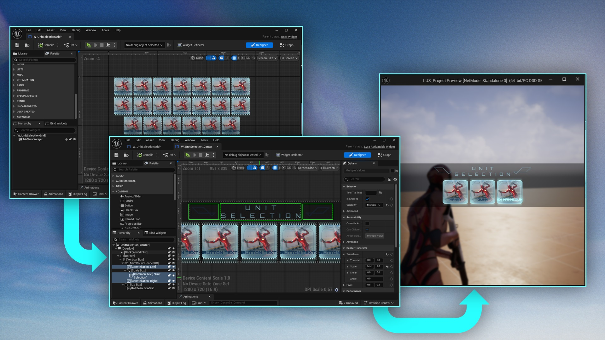
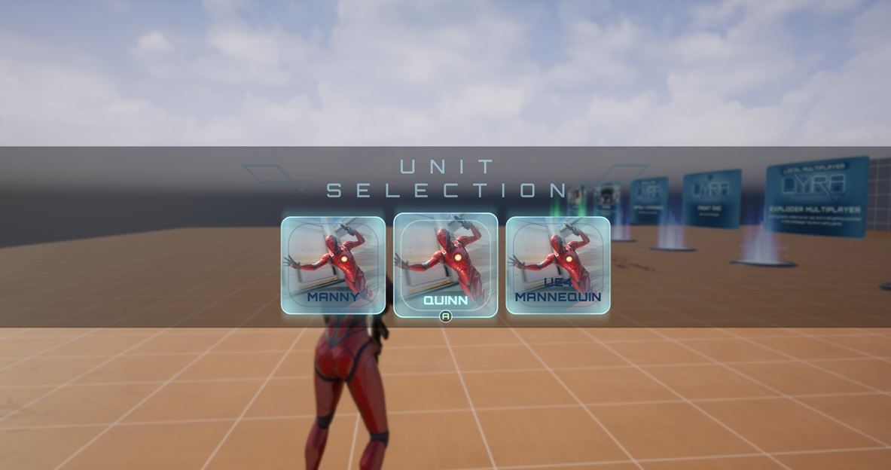
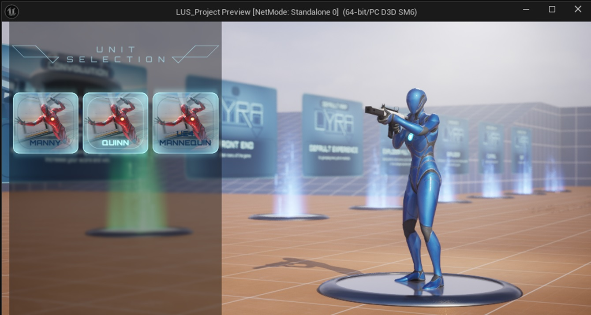
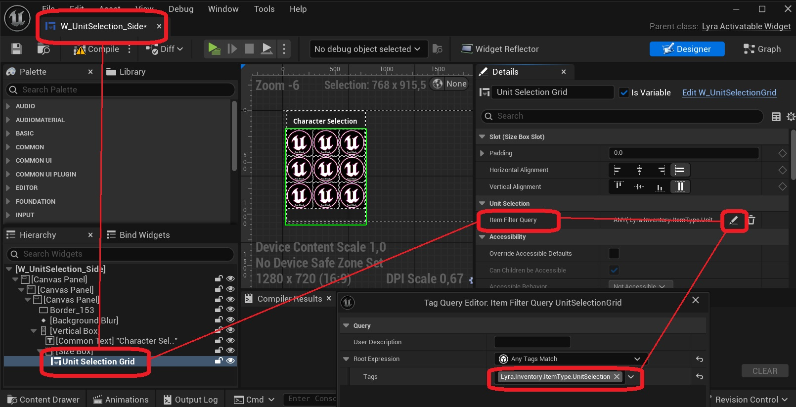

In your unit selection ability (e.g.  GA_UnitSelection_LyraUnitSelectionSample), you can specify a widget the player can use to select their unit. 

## Using the widget presets

The plugin contains two presets for these widgets:

* UI_UnitSelection_Center - Simple witget with a small unit selection grid.

* UI_UnitSelection_Side - Widget with a unit selection grid on the side, which will activate a [preview scene](/lyra-unit-selection/004-interface/020-preview-scene) when opened.

## Creating your own widgets

You can add your own widgets by creating a child class of LyraActivatableWidget. 

To use this widget for unit selection, add widget of class W_UnitSelectionGrid to its hierarchy.

In the details of this unit selection grid, you can change the Item Filter Query variable to determine which inventory items are shown. 

In the details of this unit selection grid, set the Activate Preview Scene variable to *true* if you want to make use of a [preview scene](/lyra-unit-selection/004-interface/020-preview-scene). 

## Names and icons for each unit

Each selectable unit can have its own display name and menu icon. These are defined in the equipment definition. Please refer to [this page](/lyra-unit-selection/004-interface/120-ui-icon-display-name) for more information.

