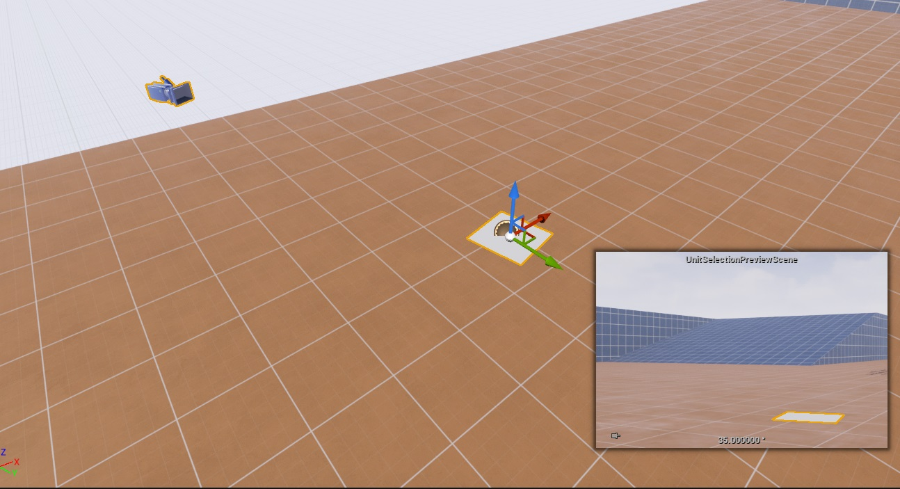
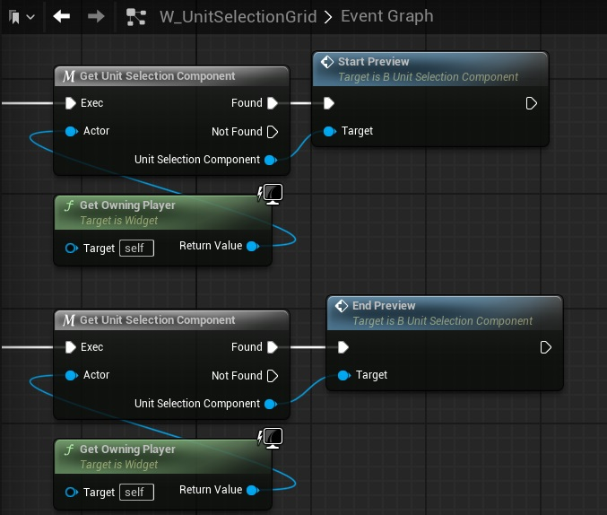
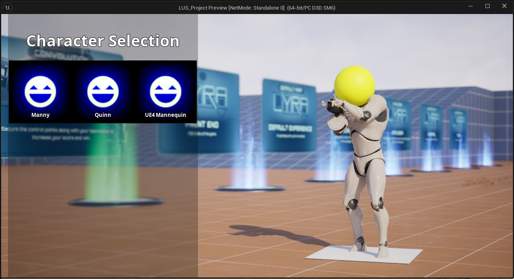

Some projects may want to use a 'character select screen' to show the player what their selected unit looks like. This can be done using the following steps:

## Placing a template in the level

First off, we need to place an actor of class B_UnitSelectionPreviewScene in our level. 

At runtime, this actor will be ued as a template and replaced with the actual preview scene that is unique to each player controller. It is also possible to create multiple scenes, in which case a random actor location will be chosen.

## Spawn a unit selection scene

Next, we need to make sure that each controller has its own instance of the unit selection scene to work with. This can be done in any of the following ways:

* In your unit selection ability (e.g.  GA_UnitSelection_LyraUnitSelectionSample), set variable Spawn Preview Scene to *true*. 

* Alternatively, you can open B_UnitSelectionComponent (or the subclass used in your project), and set Spawn Preview Scene On Begin Play to *true*.

* Alternatively, you can call function Spawn Preview Scene manually on the Unit Selection Component of the controllers you wish to spawn them for.

## Activating the preview

At runtime, we  can control the activation of this preview scene, and tell it which units to display. This can be done in the following ways:

* In most cases, the user interface will control the preview screen. To enable this behaviour for a widget, open your unit selection ability (e.g.  GA_UnitSelection_LyraUnitSelectionSample), set the Widget To Spawn to a widget class that makes use of the preview screen (e.g.   W_UnitSelection_Side). If you are using a custom widget class, select its unit selection grid. In the details panel, set the Activate Preview Scene variable to *true*.

* Alternatively, you can use the functions Start Preview, Update Preview, and End Preview on the Unit Selection Component. 

## Customizing the appearance of the preview scene

You can customize the appearance of the preview scene by creating a child class of B_UnitSelectionPreviewScene, and placing this actor in your level instead.

