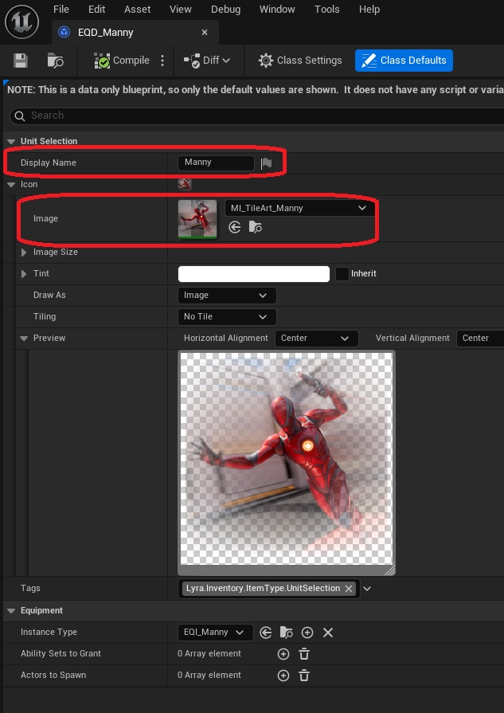

Units in the inventoy of a player can implement a UI icon to represent them in widgets. 

To add an icon, open the Equipment Definition for your unit *(EQD_MyUnit)*. In here, you can select a display name for your unit, as well as an icon to use in the user interface.

 

The icon can be an image or a material instance. The sample content has a material named (MI_UnitSelectionTileArt), which is based on Lyra's content and art style. 

 

You can optionally create icon with this material as the parent.

 

In this newly created material instance, you can swap out the image used as the tile art with your own content.

 
