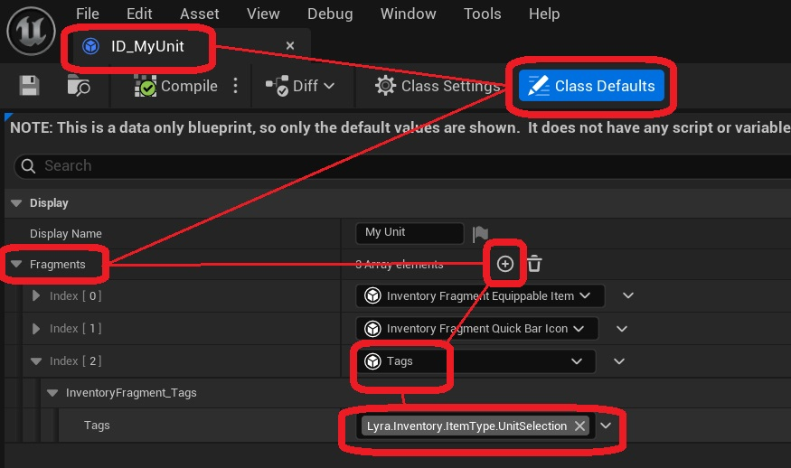
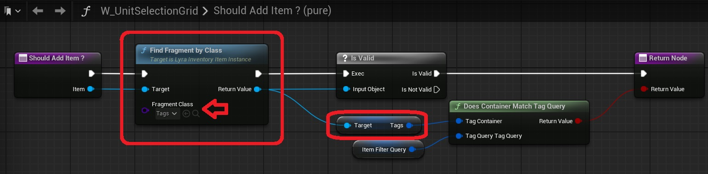

You can assign [gameplay tags](https://dev.epicgames.com/documentation/en-us/unreal-engine/gameplay-tags?application_version=4.27) to your selectable unit. These tags can be used to filter units, and to add classifications to them.

To add gameplay tags, open the Inventory Item Definition for your unit *(ID_MyUnit)*, and navigate to the Fragments variable. In this array, add an  add an inventory fragment of type UInventoryFragment_Tags. In this fragment, you can specify the desired gameplay tags.

These categories can be used depending on the needs of your project. To access them, get a reference to the inventory item you want to test, and access the fragment of type UInventoryFragment_Tags.

One example of how the plugin uses them by default, is in the user interface used by the character selection abilities. This is done to prevent the character select menu from displaying other items in the player's inventory, such as weapons.

The filters for these widgets are defined in their Unit Selection Grid, and more precisely in the Item Filter Query variable. 

