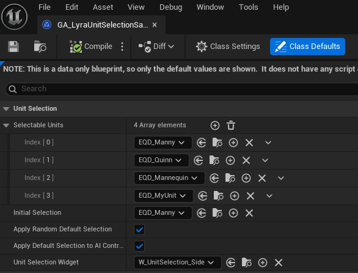
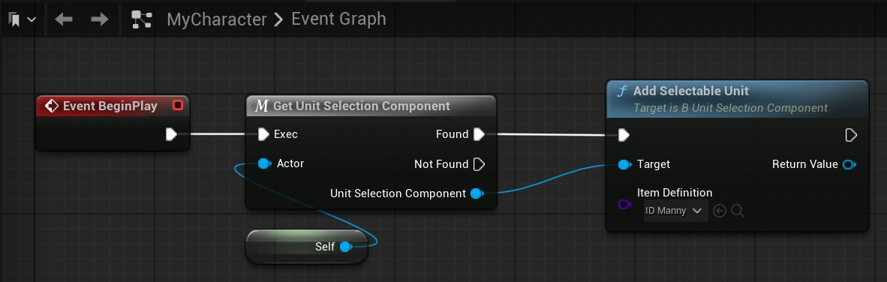

The Unit Selection Component can store a list of selectable entries the player can choose from. 

## Managing selectable units using a Gameplay Ability

If you are using a GA_UnitSelection ability, you can change the available units by setting the Selectable Units variable.

## Managing selectable units directly on the Unit Selection Component

To add or remove a selectable entry dyrectly on the Unit Selection Component, use the following functions on the Unit Selection Component:

* Add Selectable Unit
* Remove Selectable Unit

