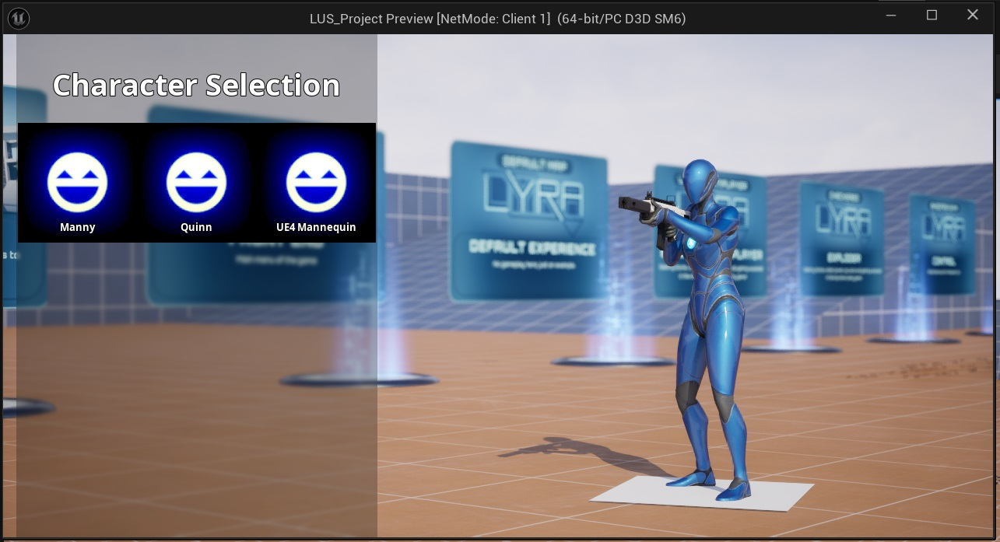
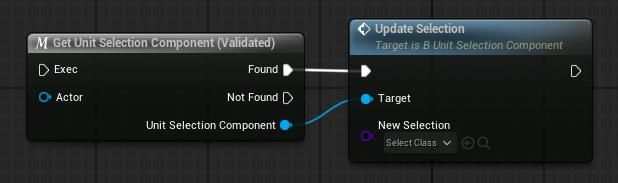

The Unit Selection Component can switch between selectable entries when the player chooes to do so. 

## Selecting units using a Gameplay Ability

If you are using a GA_UnitSelection ability, simply activate it and select a unit from the widget that appears on screen.

## Selecting units directly on the Unit Selection Component

To make a selection directly on the Unit Selection Component, use the following functions :

* Update Selection From Equipment Definition
* Update Selection From Inventory Item

## Lyra Equipment system integration

Selectable units are equipped on the pawn using [Lyra's equipment system](https://dev.epicgames.com/documentation/en-us/unreal-engine/lyra-inventory-and-equipment-in-unreal-engine).

<embed src="/pdf/lus-execution-flow.pdf" width="100%" height="420px" toolbar=0 frameborder="0" scrolling="no" />

