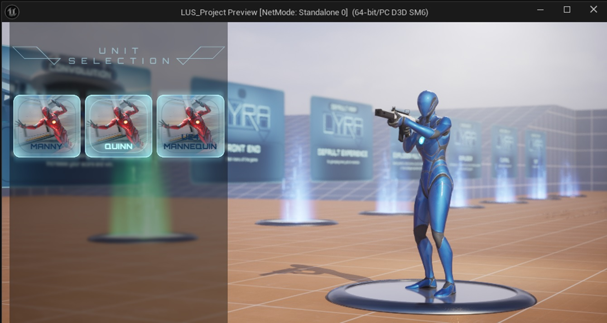
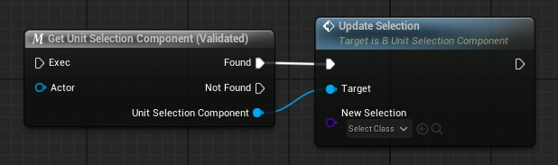
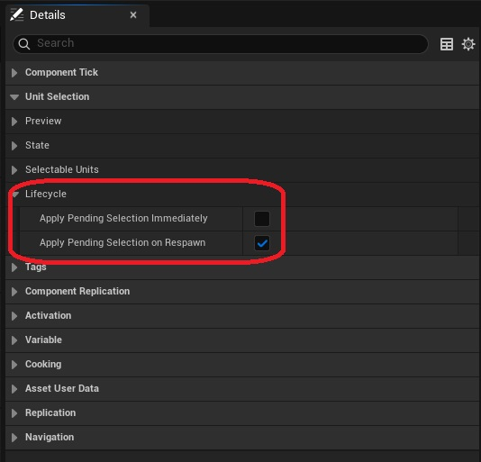

The Unit Selection Component can switch between selectable entries when the player chooses to do so. 

## Selecting units using a Gameplay Ability

If you are using a GA_UnitSelection ability, simply activate it and select a unit from the widget that appears on screen.

You can also set an Initial Selection which will be activated on spawn, or set the first selection to be random. 

## Selecting units directly on the Unit Selection Component

To make a selection directly on the Unit Selection Component, use the Update Selection function.

Once a selection is made, it will be stored on the Unit Selection Component as the Initial Selection. It will be applied when function Apply Selection is called. This can be done manually, but the component will take care of most use cases by default. To customize when to apply the selection, use the variables in the *Lifecycle* category on the Unit Selection Component.  

## Lyra Equipment system integration

Selected units are equipped on the pawn using [Lyra's equipment system](https://dev.epicgames.com/documentation/en-us/unreal-engine/lyra-inventory-and-equipment-in-unreal-engine).

<embed src="/pdf/lus-execution-flow.pdf" width="100%" height="420px" toolbar=0 frameborder="0" scrolling="no" />

