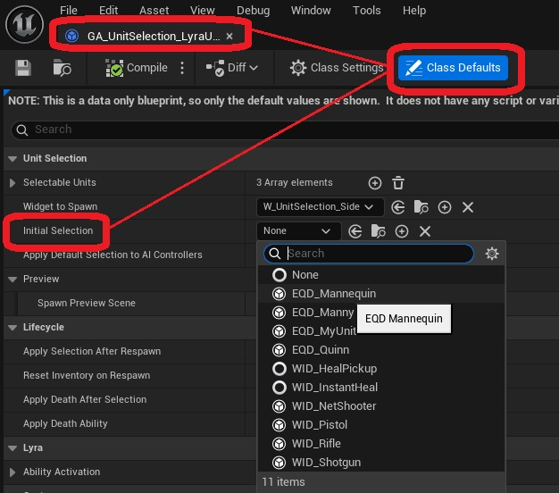
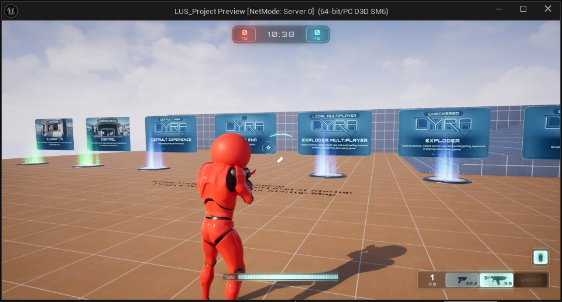

To set a default selection (starting character) for your project, follow these steps:

* Open your subclass of the GA_UnitSelection ability

* Change the Default Selection variable to the equipment definition of the unit you want to start with.

Whenever a player has this ability, it will start the game with this character selected. 

