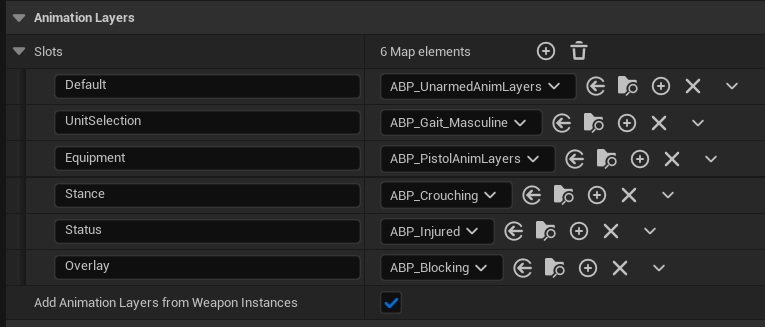
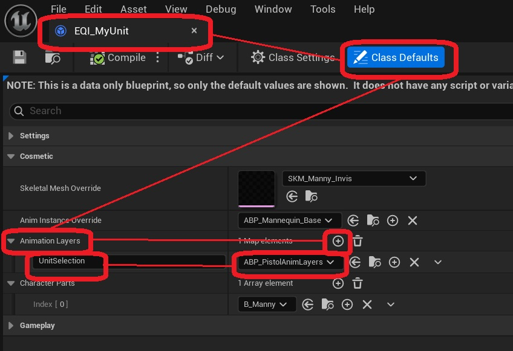
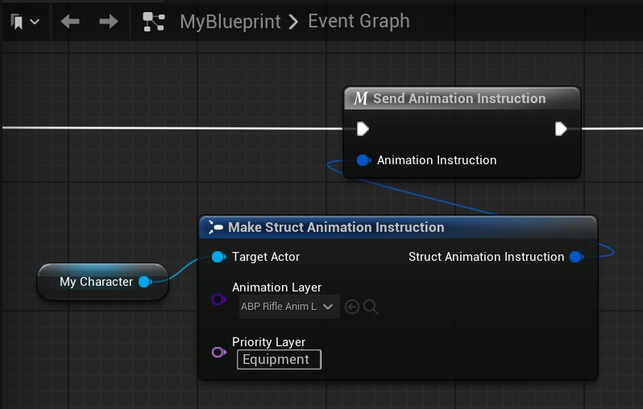

The information on this page requires prior knowledge of Animation Blueprint Linking. More information on this topic can be found in the <a href="https://dev.epicgames.com/documentation/en-us/unreal-engine/animation-blueprint-linking-in-unreal-engine">Unreal Engine Documentation</a>.
 

## The Animation Manager

The Lyra Unit Selection plugin includes an Animation Manager Component that can be added to each pawn, and process animation instructions. These instructions can be used to link animation layers on the skeletal mesh of the pawn. For example, to change the way a specific unit moves.

The Animation Manager Component has different Slots. These are different named keys in a map, that each correspond to an  Anim Instance class. These slots represent different states the pawn is in, that can each have an effect on its animation style.  

Every time the animation is updated, the layers from the  animation blueprints in all of these slots are linked in order, with the last entry in the map being linked last (thus giving that slot the highest priority).

Below is an example of what these slots may look like during gameplay.

It is possible to add, remove, or change the order of these slots by creating a subclass of the Animation Manager Component, navigating to its *class defaults*, and changing the contents of the Slots variable.

In most cases, all layers on the Animation Manager Component are empty by default. To add animation layers in them, use one of the methods bolow.

## Defining animation instructions for a selectable unit

It is possible to link animation layers while a unit is selected.

To do this, open the Equipment Instance *(EQI_MyUnit)* for your unit, and modify the Animation Layers variable. This will link the layers from the selected animation blueprints, in the selected slots. 

## Sending animation instructions manually

It is also possible to link and unlink layers using the (Send Animation Instruction) macro. To remove an anim instance from a slot, simply provide the name of the slot and leave the anim instance class set to "*none*".

