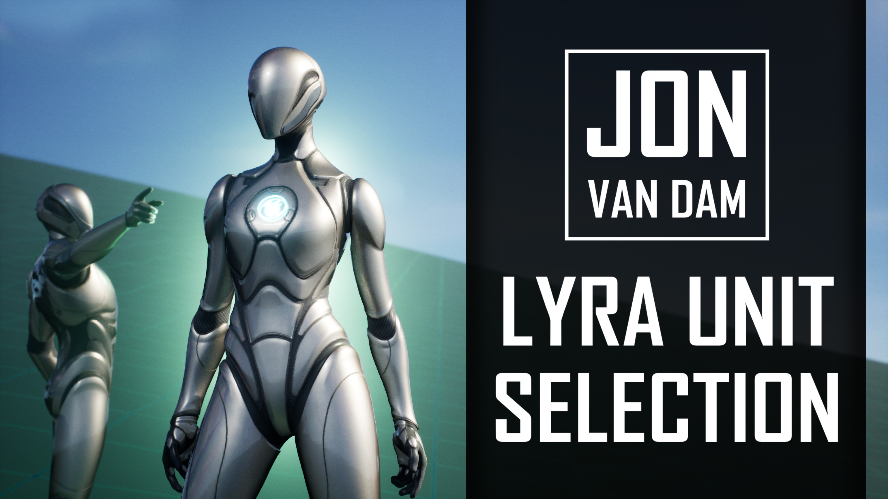

**Lyra Unit Selection is a plugin for Lyra projects in Unreal Engine 5. It allows players to dynamically switch between character presets, each with their own:**

* Gameplay abilities
* Animation set
* Skeletal mesh
* Character parts
* Default stats and attributes
* Starting inventory and equipment
* UI icons
* And more!

Lyra Unit Selection makes maximal use of Lyra's powerful systems, including Modular Gameplay, the Gameplay Ability System, Lyra's equipment and inventory systems, and Common UI. The plugin is easy to integrate in your project and is packaged as a ready-to-use game feature plugin.

**Want to add a character select feature to your Lyra project? <a href="https://www.fab.com/listings/b09b4440-58ff-478b-b2b6-c83d23cc44d1">Get the plugin on Fab!</a>**

Note on dependencies: This product can only be used in <a href="https://www.fab.com/listings/93faede1-4434-47c0-85f1-bf27c0820ad0">Lyra Starter Game</a> projects.

